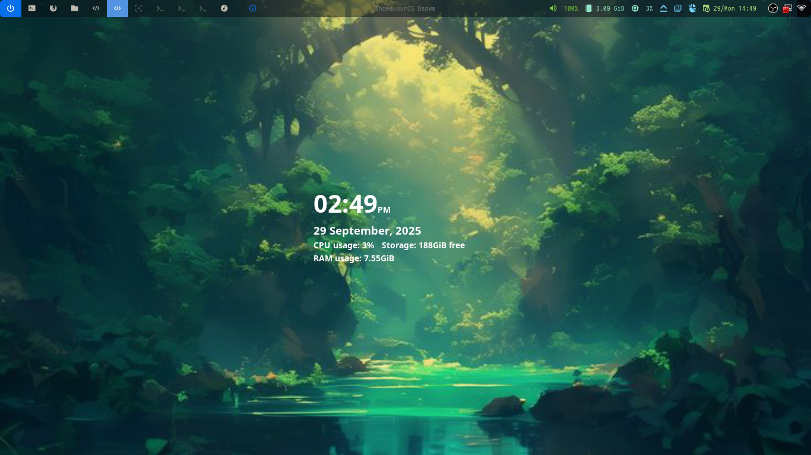
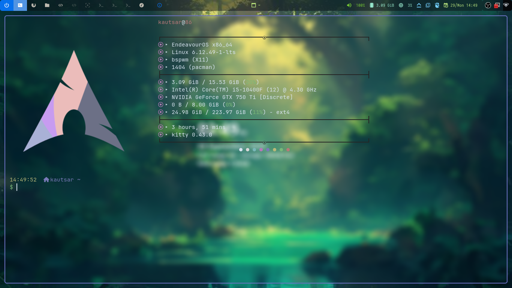
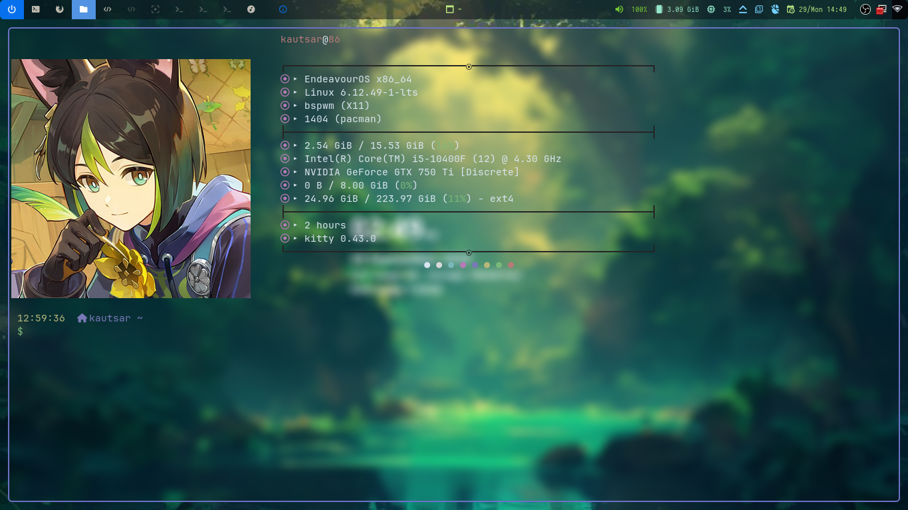
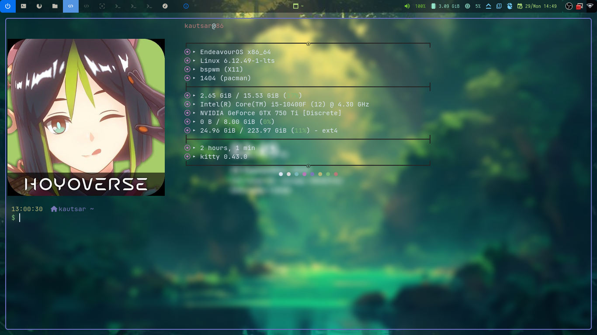
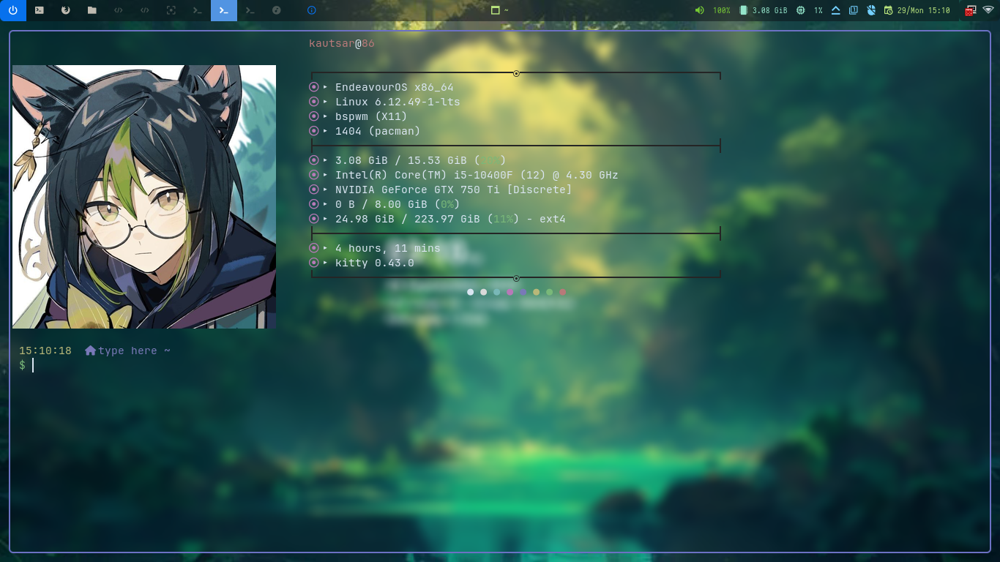
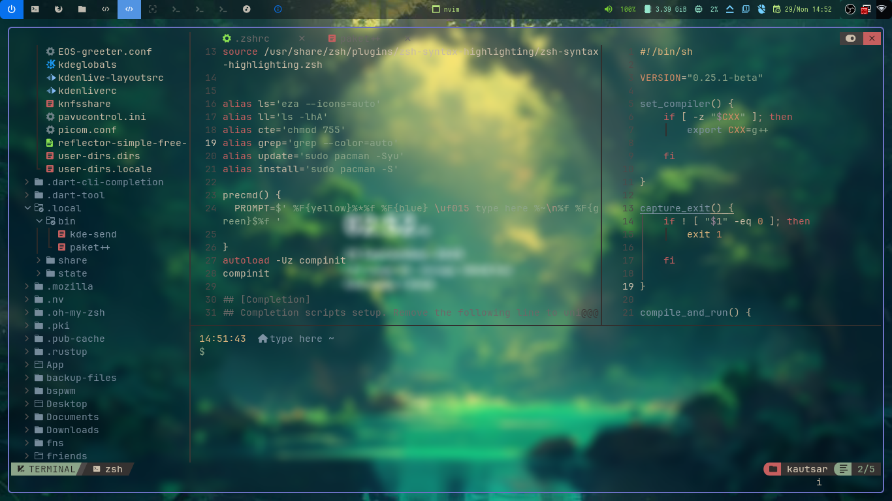

# my-personal-dotfiles
This is how I configure my Unix looks
You guys can also use mine.
For me, it is very _refreshing_ , isn't it?

## Preview

## Features
* Basic hardware status (battery, brightness, volume, Wi-Fi)
* Minimalist
* Lots of system information on screen (CPU load, swap and memory usage, username and hostname display)
* Neovim (In normal mode, press `space + h` for horizontal and `space + v` for vertical)

## Requirements
### Fonts
Primarily, I use [JetBrains font](https://github.com/ryanoasis/nerd-fonts/releases/download/v3.4.0/JetBrainsMono.zip)
### Apps
* ZSH
* Kitty
* Neovim
* BSPWM
* Picom
* Rofi
* Polybar
* scrot
* SXHKD
* BTOP++
* Conky
