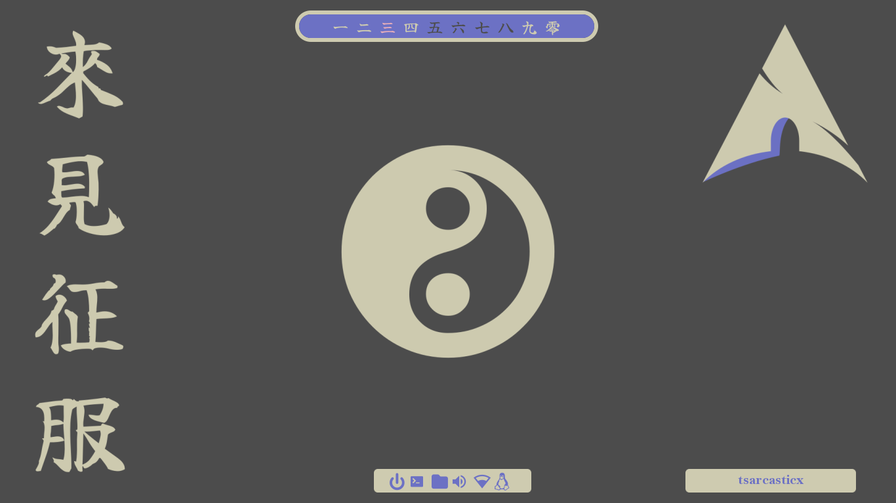
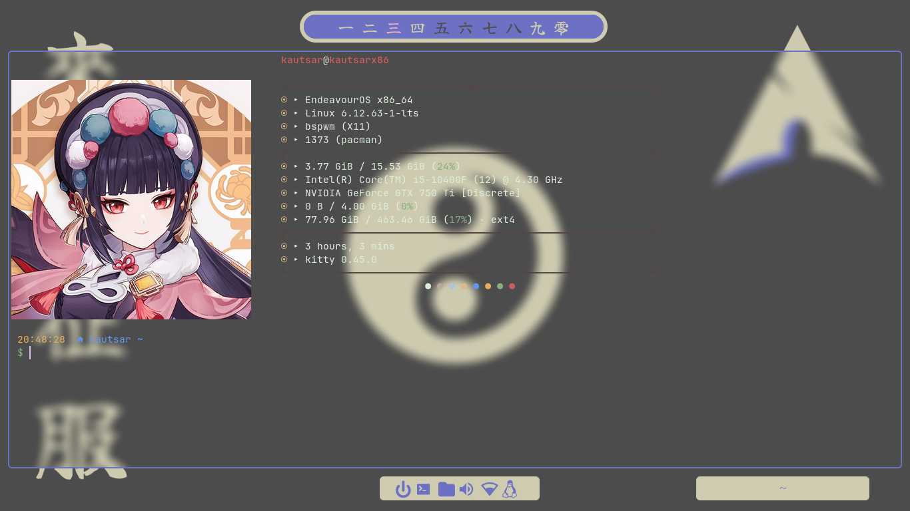
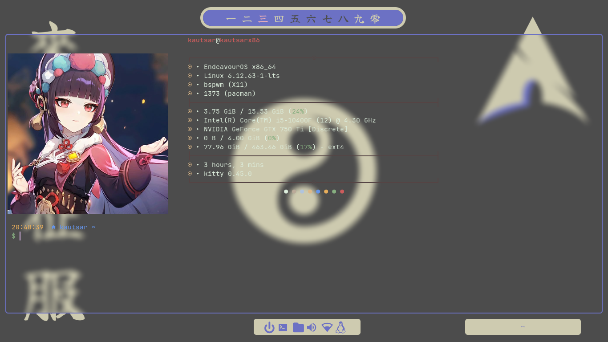
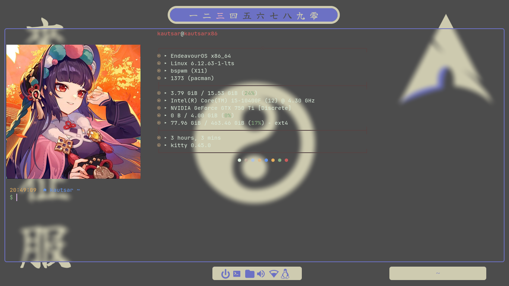
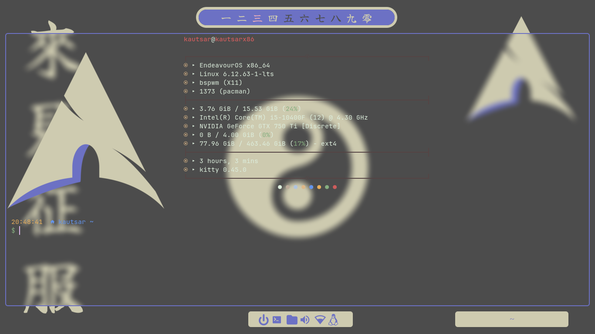
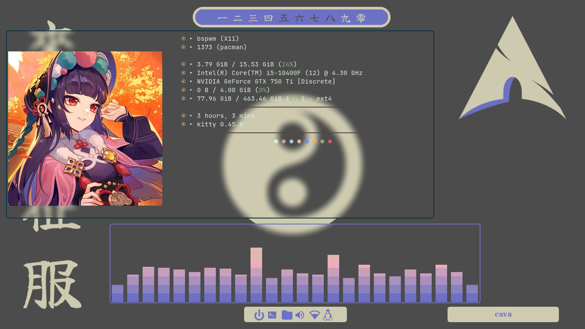

# my-personal-dotfiles
This is my second rice.
I made it because I was bored by my long weekend.

## Preview


















## Requirements
### Fonts
I use [JetBrains font](https://github.com/ryanoasis/nerd-fonts/releases/download/v3.4.0/JetBrainsMono.zip), Baskerville, and Yuji Boku.
For those who haven't installed Baskerville and Yuji Boku, you can run this script:
```sh
./to-homedir-local-share-fonts.sh
```

### Apps
* ZSH
* Kitty
* BSPWM
* Picom
* Rofi
* Polybar
* SXHKD

## How to Install
```sh
mv dotfiles/* $HOME/.config/
```
